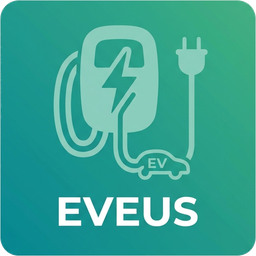
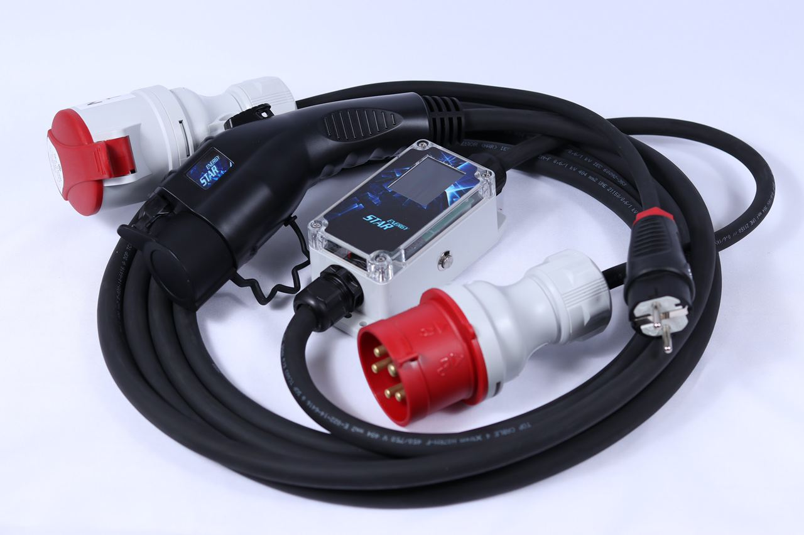

  

<h1 align="center">⚡ Eveus Charger для Home Assistant</h1>

  Інтеграція для Home Assistant із локальним опитуванням зарядних пристроїв Eveus — повний набір сутностей і нативна статистика, для обох апаратних поколінь v1 та v2.

  
  
  
  

Спочатку частково на основі [shlafik/eveuspro2ha](https://github.com/shlafik/eveuspro2ha), згодом переписано навколо єдиного coordinator опитування та вимог якості, нативних для HA.

> [!TIP]
> Documentation is also available [**in English 🇬🇧**](./README.md)

## Про інтеграцію

[Eveus](https://eveus.ua/) (раніше — ТМ **Energy Star**) — український виробник портативних зарядних пристроїв для електромобілів. Ця інтеграція підключає зарядку Eveus до Home Assistant через локальну мережу — без хмари та без облікового запису.

Після налаштування вона дозволяє:

- стежити за **станом** зарядки, струмом, напругою, потужністю, енергією та температурами;
- **запускати / зупиняти** зарядку та задавати **струм зарядки**;
- перемикати **режим AI / адаптивного живлення** зарядки;
- відстежувати енергію та час зарядки **за сесію** і **за добу**, готові для Energy Dashboard.

Зарядка існує у двох апаратних поколіннях — **v1** та **v2**, — які надають різні HTTP API на пристрої. Відповідну модель ви обираєте під час додавання інтеграції (див. [Підтримувані пристрої](#підтримувані-пристрої)).

## Чим вирізняється ця інтеграція

Для зарядних пристроїв Eveus існує кілька проєктів під Home Assistant. Ця зосереджена на:

- **Обидва апаратні покоління в одній інтеграції** — зарядки v1 та v2 надають різні HTTP API; ви обираєте модель у config flow, а відмінності (модель станів, полярність, масштабування, додаткові сенсори) обробляються всередині.
- **Першокласна статистика HA** — коректні `state_class` / `device_class` для енергії, потужності, струму та напруги, тож довгострокова статистика та Energy Dashboard працюють «з коробки». Денні сенсори енергії та часу зарядки скидаються опівночі за локальним часом і переживають перезапуск.
- **Обв'язка рівня HACS** — diagnostics (з редакцією IP/облікових даних), Repairs-issue лише для справжніх помилок, re-auth flow та міграція config-запису.
- **Єдиний coordinator опитування** — одне джерело правди про стан пристрою з динамічним опитуванням (30 с під час зарядки, 60 с в інших випадках) замість запитів від кожної сутності.
- **Надійні сигнали безпеки** — сенсори заземлення використовують debounce, щоб приглушити короткочасні збої, тоді як firmware-fault стани обходять debounce і спрацьовують одразу.
- **Локалізація з пріоритетом української** — рядки інтерфейсу українською, англійською та російською, з вбудованою brand-іконкою.

## Підтримувані пристрої

| Модель | Мін. струм | Полів JSON |
|--------|------------|------------|
| v1 | 7 A | 41 |
| v2 | 6 A | 97 |

  

### Відмінності v1 та v2

| Можливість | v1 | v2 |
|------------|----|----|
| Полярність `evseEnabled` | `1` = зарядка активна | `0` = зарядка активна |
| Модель станів | 22 стани — помилки та ліміти закодовані в єдиному полі `state` | 8 станів верхнього рівня в `state` + `subState` для деталізації ліміту / помилки |
| Режими AI | Off, Voltage | Off, Voltage, Tesla (auto), Power |
| Формат `systemTime` | рядок `"HH:MM:SS"` | Unix timestamp (ціле) |
| Значення вимірювань | Сирі цілі — `curMeas1` та поля енергії масштабовані ×0.1 | Реальні float у нативних одиницях |
| `powerMeas` | Немає у відповіді — обчислюється як V × I | Повідомляється пристроєм напряму |
| Додаткові сенсори | — | `subState`, `vBat`, `RSSI`, `IEM1`, `IEM2` |
| Синхронізація часу | — | кнопка `sync_time` (записує Unix timestamp у пристрій) |

## Встановлення

### Вручну

1. Скопіюйте `custom_components/eveus/` до `/config/custom_components/eveus/` на вашому екземплярі HA.
2. Перезапустіть Home Assistant.
3. **Налаштування → Інтеграції → Додати → Eveus Charger**.

### HACS

Найшвидший спосіб — натисніть кнопку нижче, щоб відкрити діалог додавання кастомного репозиторію вже заповненим:

Або додайте вручну:

1. Відкрийте HACS → **Інтеграції**.
2. Натисніть меню з трьох крапок (⋮) у правому верхньому куті → **Користувацькі репозиторії**.
3. Введіть `https://github.com/Soundistor/ha-eveus` та оберіть категорію **Integration** → **Додати**.
4. Знайдіть **Eveus Charger** у списку та натисніть **Завантажити**.
5. Перезапустіть Home Assistant.
6. **Налаштування → Інтеграції → Додати → Eveus Charger**.

## Конфігурація

| Поле | Опис |
|------|------|
| IP-адреса | IP зарядки (напр. `192.168.x.x`) |
| Модель | `v1` або `v2` |
| Ім'я користувача | Необов'язково (залиште порожнім, якщо не задано) |
| Пароль | Необов'язково (залиште порожнім, якщо не задано) |
| Префікс пристрою | Префікс для entity ID, напр. `eveus_1` або `eveus_home` |

**Префікс пристрою** визначає entity ID: префікс `eveus_1` дає `sensor.eveus_1_state`, `sensor.eveus_1_currentset` тощо. Задайте його відповідно до ваших наявних автоматизацій.

## Сутності

### Сенсори — обидві моделі

| Сутність | Одиниця | Примітки |
|----------|---------|----------|
| `state` | — | Стан зарядки у читабельному вигляді |
| `currentset` | A | Заданий струм зарядки |
| `curmeas1` | A | Виміряний струм зарядки |
| `voltmeas1` | V | Виміряна напруга |
| `powermeas` | W | Потужність зарядки |
| `temperature1` | °C | Датчик 1 |
| `temperature2` | °C | Датчик 2 |
| `aistatus` | — | Активний режим AI |
| `aivoltage` | V | Уставка напруги AI |
| `curdesign` | A | Проєктний макс. струм |
| `sessiontime` | s | Тривалість сесії (сирі секунди) |
| `session_time_daily` | h | Час зарядки від локальної півночі (скидається щодня, переживає перезапуск) |
| `sessionenergy` | kWh | Енергія за цю сесію |
| `totalenergy` | kWh | Загальна енергія (накопичувально) |
| `energy_daily` | kWh | Енергія зарядки від локальної півночі (скидається щодня, переживає перезапуск) |
| `systemtime` | — | Годинник зарядки |
| `leakvalue` | mA | Струм витоку (діагностика) |

### Сенсори — лише V2

| Сутність | Одиниця | Примітки |
|----------|---------|----------|
| `substate` | — | Деталізований підстан (ліміт або помилка) |
| `vbat` | V | Напруга батареї (діагностика) |
| `rssi` | dBm | Сигнал Wi-Fi (діагностика) |
| `iem1` | kWh | Лічильник енергії 1 (накопичувально) |
| `iem2` | kWh | Лічильник енергії 2 (накопичувально) |

### Інші сутності

| Платформа | Сутність | Примітки |
|-----------|----------|----------|
| `switch` | `charging` | Старт / стоп зарядки |
| `number` | `current_set` | Уставка струму зарядки |
| `select` | `ai_mode` | Вибір режиму AI |
| `binary_sensor` | `ground` | Заземлення в нормі |
| `binary_sensor` | `groundctrl` | Захист заземлення активний |
| `button` | `force_refresh` | Примусове оновлення даних |
| `button` | `sync_time` | Синхронізувати годинник зарядки з часом HA (лише V2) |

## Сервіси

Крім сутностей вище, для автоматизацій і скриптів доступні два сервіси:

| Сервіс | Опис |
|--------|------|
| `eveus.set_current` | Задати струм зарядки в амперах. |
| `eveus.set_ai_mode` | Задати режим AI / адаптивного живлення. Доступні режими залежать від моделі — див. [таблицю v1 та v2](#відмінності-v1-та-v2). |

Обидва приймають `entity_id` будь-якої сутності, що належить зарядці.

## Локалізація

Рядки інтерфейсу доступні українською (uk), англійською (en) та російською (ru).

## Діагностика

Підтримується стандартна діагностика HA: **Налаштування → Інтеграції → Eveus → Завантажити діагностику**. IP-адреса, ім'я користувача та пароль приховуються у виводі.

## Примітки

- Інтервал опитування динамічний: 30 с під час зарядки, 60 с в інших випадках.
- Коли зарядку вимкнено або від'єднано, її сутності просто стають **недоступними** — це нормально й **не** створює repair-issue. Repair-issue створюється лише коли зарядка доступна, але повертає помилку (напр. невірні облікові дані або налаштована версія API не відповідає прошивці).
- `ground` і `groundctrl` використовують debounce (3 послідовні опитування), щоб приглушити короткочасні збої; firmware-fault стани обходять debounce і спрацьовують одразу.
- `groundctrl` використовує значення `2` для активного стану (не `1`) — оброблено коректно.
- Усі імена сутностей у нижньому регістрі, щоб відповідати застарілим unique ID на основі YAML і зберегти автоматизації.
- Інтеграція постачає власну іконку (`brand/`), яка показується автоматично на Home Assistant 2026.3+ через локальний brands-проксі. На старіших версіях іконка потребує сабміту до [home-assistant/brands](https://github.com/home-assistant/brands).
